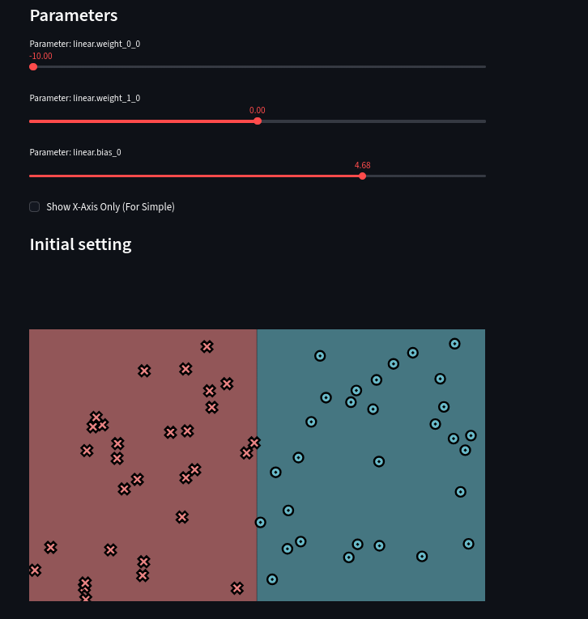

# MiniTorch Module 0

* Docs: https://minitorch.github.io/

* Overview: https://minitorch.github.io/module0/module0/

# Task 0.5: Visualization

# Linear dataset classification

Using **Simple** dataset.

**Parameters used:**
- w1 = -10.0
- w2 = 0.0
- bias = 4.68

All points are correctly separated by the line x = 0.468.